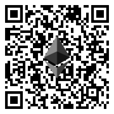

# *btcrecover*   #

*btcrecover* is an open source wallet password and seed recovery tool. It is designed for the case where you already know most of your password or seed phrase, but need assistance in trying different possible combinations.

* Seed/Passphrase Recovery when you have a known address you have used for:
    * Bitcoin
    * Bitcoin Cash
    * Ethereum
    * Litecoin
    * Dash
    * Dogecoin
    * Vertcoin
    * Monacoin
    * DigiByte
    * And many other 'Bitcoin Like' cryptos
 * Seed/Passphrase recovery via Address DB (Where you don't need to know an address to search for) supporting:
    * Bitcoin
    * Bitcoin Cash
    * Litecoin
    * Vertcoin
    * Monacoin
    * DigiByte
    * Likely many other 'Bitcoin like' cryptos
 * [Descrambling 12 word seeds](docs/BIP39_descrambling_seedlists.md) (Using Tokenlist feature for BIP39 seeds via seedrecover.py)
 * Wallet File password recovery for a range of wallets

**_If you want the tool to support a crypto that isn't listed above, please test that it works and submit a PR which includes a unit test for that coin and also any required code to accept the address format._**

## Setup and Usage Tutorials ##
BTCRecover is a Python (3.6+) script so will run on Windows, Linux and Mac environments. [See the installation guide for more info](INSTALL.md)

[I have created a growing playlist](https://www.youtube.com/playlist?list=PL7rfJxwogDzmd1IanPrmlTg3ewAIq-BZJ) that covers a number of usage examples for using this tool to recover seed phrases, BIP39 passphrases, etc.

This repositoy also included some [example commands and file templates](docs/Usage_Examples/UsageExamples.md) for the usage scenarios covered in YouTube videos.

My suggestion is that you find a scenario that is most-like your situation and try to replicate my examples to ensure that you have the tool set up and running correctly. If you have a specific situation that isn't covered in these tutorials, let me know and I can look into creating a video for that.

[Sending me a message via Reddit](https://www.reddit.com/user/Crypto-Guide) is likely the best channel to reach me for support with this tool.

If you don't know an address in the wallet that you are searching for, you can create and use an [Address Database](docs/Creating_and_Using_AddressDB.md) _There is no real performance penalty for doing this, it just takes a bit more work to set up_.

## Quick Start ##

To try recovering your password or a BIP39 passphrase, please start with the **[Password Recovery Quick Start](TUTORIAL.md#btcrecover-tutorial)**.

If you mostly know your recovery seed/mnemonic (12-24 recovery words), but think there may be a mistake in it, please see the **[Seed Recovery Quick Start](docs/Seedrecover_Quick_Start_Guide.md)**.

## If this tool or other content on my YouTube channel was helpful, feel free to send a tip to: ##

BTC: 37N7B7sdHahCXTcMJgEnHz7YmiR4bEqCrS

BCH: qpvjee5vwwsv78xc28kwgd3m9mnn5adargxd94kmrt

LTC: M966MQte7agAzdCZe5ssHo7g9VriwXgyqM

ETH: 0x72343f2806428dbbc2C11a83A1844912184b4243

## Thanks to Gurnec ##
This tool builds on the original work of Gurnec who created it and maintained it until late 2017. If you find *btcrecover* helpful, please consider a small donation to them too. (I will also be passing on a portion of any tips I recieve at the addys above to them too)

BTC: 3Au8ZodNHPei7MQiSVAWb7NB2yqsb48GW4

**Thank You!**

## Features ##
* Seed Phrase (Mnemonic) Recovery for the following wallets
     * [Electrum](https://electrum.org/) (1.x, 2.x, 3.x and 4.x) (For Legacy and Segwit Wallets. Set --bip32-path "m/0'/0" for a Segwit wallet, leave bip32-path blank for Legacy... No support for 2fa wallets...)
     * [Electron-Cash](https://www.electroncash.org/) (2.x, 3.x and 4.x)
     * BIP-32/39 compliant wallets ([bitcoinj](https://bitcoinj.github.io/)), including:
         * [MultiBit HD](https://multibit.org/)
         * [Bitcoin Wallet for Android/BlackBerry](https://play.google.com/store/apps/details?id=de.schildbach.wallet) (with seeds previously extracted by [decrypt\_bitcoinj\_seeds](https://github.com/gurnec/decrypt_bitcoinj_seed))
         * [Hive for Android](https://play.google.com/store/apps/details?id=com.hivewallet.hive.cordova), [for iOS](https://github.com/hivewallet/hive-ios), and [Hive Web](https://hivewallet.com/)
         * [Breadwallet](https://brd.com/)
     * BIP-32/39/44 Bitcoin & Ethereum compliant wallets, including:
         * [Mycelium for Android](https://wallet.mycelium.com/)
         * [TREZOR](https://www.bitcointrezor.com/)
         * [Ledger](https://www.ledgerwallet.com/)
         * [Keepkey](https://shapeshift.io/keepkey/)
         * [Jaxx](https://jaxx.io/)
         * [Coinomi](https://www.coinomi.com/)
         * [Exodus](https://www.exodus.io/)
         * [MyEtherWallet](https://www.myetherwallet.com/)
         * [Bither](https://bither.net/)
         * [Blockchain.com](https://blockchain.com/wallet)
 * Bitcoin wallet password recovery support for:
     * [Bitcoin Core](https://bitcoincore.org/)
     * [MultiBit HD](https://multibit.org/) and [MultiBit Classic](https://multibit.org/help/v0.5/help_contents.html)
     * [Electrum](https://electrum.org/) (1.x, 2.x, 3.x and 4.x) (For Legacy and Segwit Wallets. Set --bip32-path "m/0'/0" for a Segwit wallet, leave bip32-path blank for Legacy... No support for 2fa wallets...)
     * Most wallets based on [bitcoinj](https://bitcoinj.github.io/), including [Hive for OS X](https://github.com/hivewallet/hive-mac/wiki/FAQ)
     * BIP-39 passphrases, Bitcoin & Ethereum supported (e.g. [TREZOR](https://www.bitcointrezor.com/) & [Ledger](https://www.ledgerwallet.com/) passphrases)
     * [mSIGNA (CoinVault)](https://ciphrex.com/products/)
     * [Blockchain.com](https://blockchain.com/wallet)
     * [pywallet --dumpwallet](https://github.com/jackjack-jj/pywallet) of Bitcoin Unlimited/Classic/XT/Core wallets
     * [Bitcoin Wallet for Android/BlackBerry](https://play.google.com/store/apps/details?id=de.schildbach.wallet) spending PINs and encrypted backups
     * [KnC Wallet for Android](https://github.com/kncgroup/bitcoin-wallet) encrypted backups
     * [Bither](https://bither.net/)
 * Altcoin password recovery support for most wallets derived from one of those above, including:
     * [Litecoin Core](https://litecoin.org/)
     * [Electrum-LTC](https://electrum-ltc.org/) (For Legacy and Segwit Wallets. Set --bip32-path "m/0'/0" for a Segwit wallet, leave bip32-path blank for Legacy... No support for 2fa wallets...)
     * [Electron-Cash](https://www.electroncash.org/) (2.x, 3.x and 4.x)
     * [Litecoin Wallet for Android](https://litecoin.org/) encrypted backups
     * [Dogecoin Core](http://dogecoin.com/)
     * [MultiDoge](http://multidoge.org/)
     * [Dogecoin Wallet for Android](http://dogecoin.com/) encrypted backups
 * [Free and Open Source](http://en.wikipedia.org/wiki/Free_and_open-source_software) - anyone can download, inspect, use, and redistribute this software
 * Supported on Windows, Linux, and OS X
 * Support for Unicode passwords and seeds
 * Multithreaded searches, with user-selectable thread count
 * Experimental [GPU acceleration](docs/GPU_Acceleration.md) for Bitcoin Core and derived altcoin wallets
 * Wildcard expansion for passwords
 * Typo simulation for passwords and seeds
 * Progress bar and ETA display (at the command line)
 * Optional autosave - interrupt and continue password recoveries without losing progress
 * Automated seed recovery with a simple graphical user interface
 * “Offline” mode for nearly all supported wallets - use one of the [extract scripts (click for more information)](docs/Extract_Scripts.md) to extract just enough information to attempt password recovery, without giving *btcrecover* or whoever runs it access to *any* of the addresses or private keys in your Bitcoin wallet.
